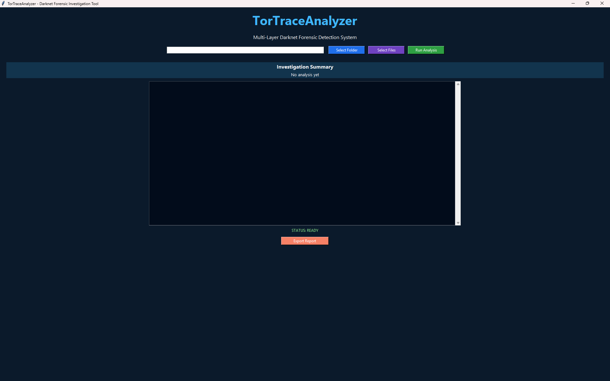

# TorTraceAnalyzer

## Tool Interface

## Description

TorTraceAnalyzer is a multi-layer darknet forensic investigation tool designed to detect Tor browser usage and potential insider data exfiltration attempts.

## Features

- Memory artifact analysis
- System artifact detection
- Network traffic analysis
- Application artifact detection
- Artifact correlation engine
- Timeline reconstruction
- Risk scoring
- GUI investigation dashboard
- Automated forensic report generation

## Architecture

TorTraceAnalyzer performs forensic analysis across multiple layers:

1. Memory Layer
   - Detects running Tor processes

2. System Layer
   - Identifies system artifacts indicating Tor execution

3. Network Layer
   - Detects Tor network indicators and relay IPs

4. Application Layer
   - Finds browser artifacts related to Tor usage

The results are correlated to reconstruct activity timelines and generate risk scores.

## Technologies

Python, Digital Forensics Techniques, Artifact Correlation

## Installation

1. Clone the repository

    git clone https://github.com/Rady0-0/TorTraceAnalyzer.git

2. Go to the project folder

    cd TorTraceAnalyzer

3. Install dependencies

    pip install -r requirements.txt

4. Run the tool

    python gui.py

## Usage

1. Launch the application

    python gui.py

2. Select evidence files or folders using the GUI.

3. Click **Run Analysis**.

4. The tool will analyze forensic artifacts across multiple layers:
   - Memory
   - System
   - Network
   - Application

5. The results will appear in the investigation dashboard.

6. A forensic report will automatically be generated in the project     directory.

## Output

After analysis, TorTraceAnalyzer produces:

- Layer detection results
- Artifact correlation findings
- Activity timeline reconstruction
- Risk score assessment
- Confidence level estimation

A forensic report is automatically generated as:

 tortrace_report.txt

This report summarizes the investigation results and can be used for further forensic documentation.

 ## Disclaimer

    *This tool is part of a BSc Digital Forensics major project.*  