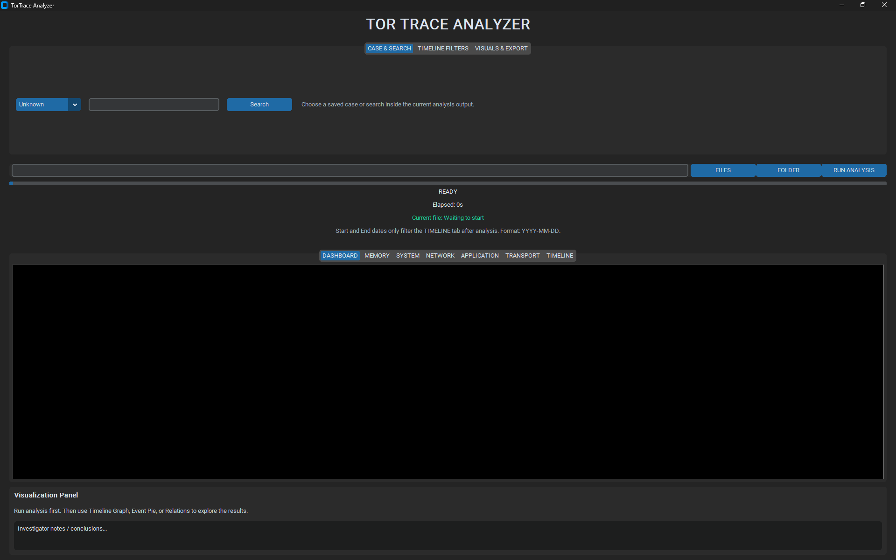

# TorTraceAnalyzer

TorTraceAnalyzer is a Python-based digital forensics tool for detecting and correlating Tor activity across multiple evidence layers. It combines disk-style artifacts, memory-style artifacts, network indicators, packet captures, correlation logic, timeline reconstruction, and reporting in a desktop interface built with CustomTkinter.

## What the tool does

- Parses evidence files and folders recursively.
- Runs multi-layer analysis across memory, system, network, application, and transport indicators.
- Normalizes detections into a single pipeline for correlation and FCI scoring.
- Reconstructs a MACB-style timeline from available timestamps.
- Exports reports to TXT, CSV, Excel, JSON, and PDF.
- Packages into a portable Windows EXE for users who do not have Python installed.

## Supported input files

You can provide either individual files or folders containing mixed evidence.

Accepted file types:

- `.txt`, `.log`, `.csv`
- `.json`
- `.xlsx`, `.xls`
- `.docx`
- `.html`, `.htm`
- `.raw`, `.mem`, `.dmp`, `.bin`
- `.e01`
- `.pcap`, `.pcapng`

Notes:

- `.e01` is recognized as a disk-image indicator but is not deeply parsed directly.
- `.pcap` and `.pcapng` are analyzed offline from the file itself. Live sniffing is not required.
- For best results, use exported reports from tools such as Wireshark, Volatility, FTK Imager, or Autopsy.

## Analysis pipeline

The project now follows this pipeline consistently:

`file_parser -> analysis modules -> all_detections -> correlation -> FCI -> timeline/report -> GUI`

Each detection is normalized into the same structure:

```python
{
    "layer": "...",
    "file_name": "...",
    "message": "...",
    "evidence_match": "...",
    "disk_timestamps": {
        "modified": "...",
        "created": "...",
        "accessed": "..."
    }
}
```

## GUI overview

- `DASHBOARD`: Overall summary, FCI, correlation, detected artifacts, engine messages.
- `MEMORY`, `SYSTEM`, `NETWORK`, `APPLICATION`, `TRANSPORT`: Layer-specific findings.
- `TIMELINE`: Reconstructed artifact timeline filtered by date.
- `Timeline Graph`: Shows timeline events as horizontal bars.
- `Evidence Pie`: Shows the distribution of detections by forensic layer.
- `Relations`: Shows which artifacts came from which forensic layers.

## Interface notes

- `From date` and `To date` filter the `TIMELINE` tab and `Timeline Graph` only. They do not change the forensic scan.
- The timeline is intentionally built from `System` and `Application` artifact timestamps only.
- `Network`, `Transport`, and `Memory` detections do not drive the timeline because uploaded report-file times can be misleading.
- `Evidence Pie` is based on the number of detections per layer in the current case.
- `Relations` maps each detected artifact to the layer that produced it.

## Running from source

1. Create and activate a virtual environment.
2. Install dependencies.
3. Launch the GUI.

```powershell
python -m venv venv
.\venv\Scripts\activate
pip install -r requirements.txt
python gui.py
```

## Building the EXE

The repo includes PyInstaller packaging files.

Build the EXE:

```powershell
powershell -ExecutionPolicy Bypass -File .\scripts\build_exe.ps1
```

Build a portable release zip:

```powershell
powershell -ExecutionPolicy Bypass -File .\scripts\build_release.ps1
```

Output locations:

- EXE: `dist\TorTraceAnalyzer.exe`
- Portable release zip: `release\TorTraceAnalyzer_Portable_<date>.zip`

## EXE portability notes

The packaged EXE has been hardened for use on other Windows systems:

- runtime temp/cache folders are redirected to safe writable locations,
- case data is stored under `%LOCALAPPDATA%\TorTraceAnalyzer`,
- report/temp graph paths do not depend on the launch directory,
- PCAP parsing is bundled for offline `.pcap` and `.pcapng` processing,
- the app no longer requires the source code beside the EXE.

Because the EXE is unsigned, Windows SmartScreen may show a warning. If needed, click `More info` and then `Run anyway`.

## Repository layout

```text
assets/                 icons, logo, screenshot
hooks/                  PyInstaller runtime hook
scripts/                EXE and release build scripts
samples/                small demo evidence files
app_paths.py            app-safe resource and writable path helpers
gui.py                  desktop interface
main.py                 orchestration pipeline
file_parser.py          evidence parsing and classification
*_analysis.py           per-layer analyzers
pcap_transport_analysis.py  packet capture analysis
artifact_correlation.py correlation logic
risk_scoring.py         FCI scoring
timeline_reconstruction.py timeline builder
report_generator.py     report exports
TorTraceAnalyzer.spec   PyInstaller spec for the Windows EXE
```

## Validation completed

Before preparing the current release candidate, the project was checked for:

- successful Python compilation of core modules,
- successful module imports,
- end-to-end smoke testing of the analysis pipeline,
- `.pcap` and `.pcapng` routing,
- successful PyInstaller EXE build,
- packaged EXE startup validation.

## Dashboard preview



## Disclaimer

This project is intended for authorized forensic, educational, and research use. Always ensure that you have legal authority to analyze the evidence being processed.
